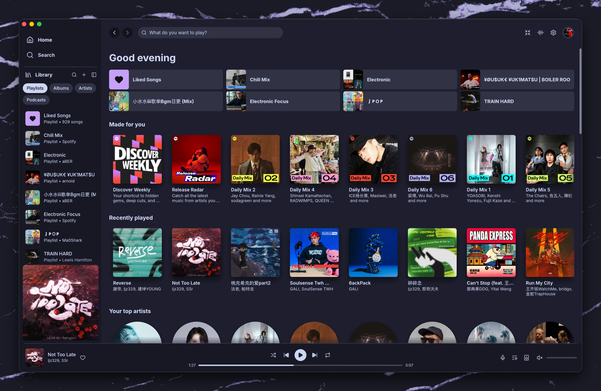
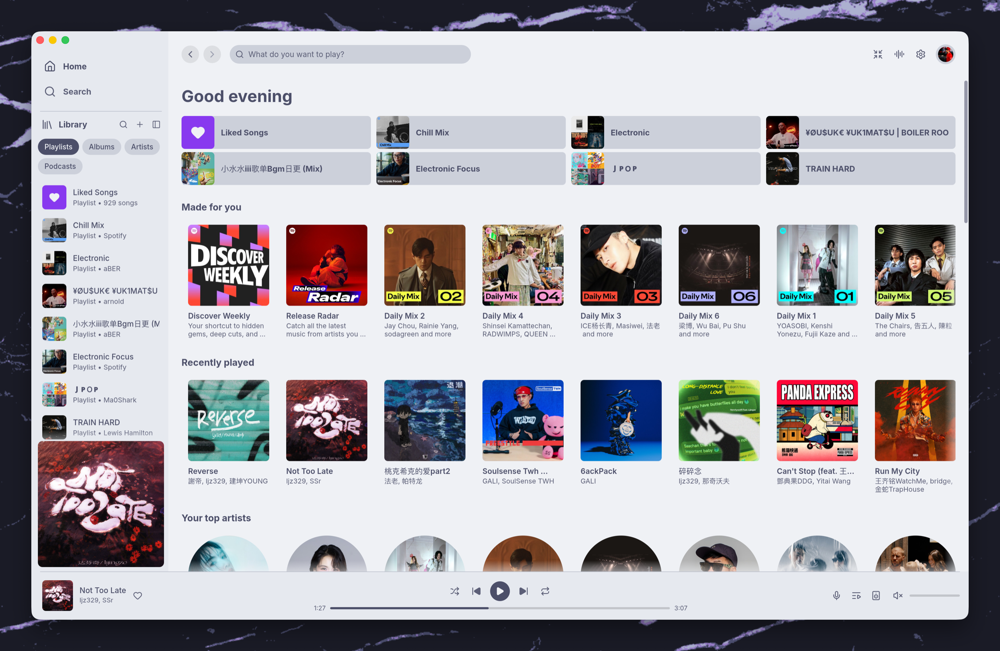

# Fastpotify Catppuccin

A Catppuccin-themed build of [Fastpotify](https://github.com/crmne/fastpotify).

- **Mocha** dark theme
- **Latte** light theme
- System theme switching
- Flat Catppuccin surfaces without album-art gradients
- Catppuccin colours for selections, controls, warnings, and errors

## Theme previews

### Mocha



### Latte



Choose **Dark (Mocha)**, **Light (Latte)**, or **Follow system** in
**Settings → Appearance → Theme**.

Automatic and manual update checks use this fork's GitHub Releases page, not
the upstream Fastpotify releases.

## Build

Fastpotify requires Rust 1.95 or newer.

```sh
git clone https://github.com/aBER0724/fastpotify-catppuccin.git
cd fastpotify-catppuccin
cargo build --release --locked --no-default-features
```

The binary is written to `target/release/fastpotify`.

`--no-default-features` disables MilkDrop and avoids its additional CMake,
C++ compiler, and libclang dependencies. Omit it to build with MilkDrop.

## Install on macOS

Build and package the current source as a normal macOS application:

```sh
cargo build --release --locked --no-default-features
version=$(sed -n 's/^version = "\(.*\)"/\1/p' Cargo.toml | head -1)
./packaging/macos/bundle.sh target/release/fastpotify \
  "$HOME/Applications/Fastpotify.app" "$version"
open "$HOME/Applications/Fastpotify.app"
```

The packaging script creates the app icon, registers `spotify:` links, and
applies an ad-hoc signature. Run the commands again after updating the source.

To install for every user, package to a temporary location and copy it to
`/Applications`:

```sh
./packaging/macos/bundle.sh target/release/fastpotify \
  /tmp/Fastpotify.app "$version"
sudo rm -rf /Applications/Fastpotify.app
sudo cp -R /tmp/Fastpotify.app /Applications/
open /Applications/Fastpotify.app
```

If macOS keeps showing an older icon, refresh the application and Dock caches:

```sh
touch /Applications/Fastpotify.app
killall Dock
```

## Install the binary only

```sh
cargo install --path . --locked --no-default-features --force
fastpotify
```

Cargo installs the executable to `~/.cargo/bin/fastpotify`. Add that directory
to `PATH` if the command is not found:

```sh
echo 'export PATH="$HOME/.cargo/bin:$PATH"' >> ~/.zshrc
source ~/.zshrc
```

## Upstream

Fastpotify is a native Spotify client powered by librespot. Playback requires
Spotify Premium. For usage, supported platforms, and project documentation,
see the [upstream Fastpotify repository](https://github.com/crmne/fastpotify).

Catppuccin is available under the
[Catppuccin palette](https://github.com/catppuccin/catppuccin).
